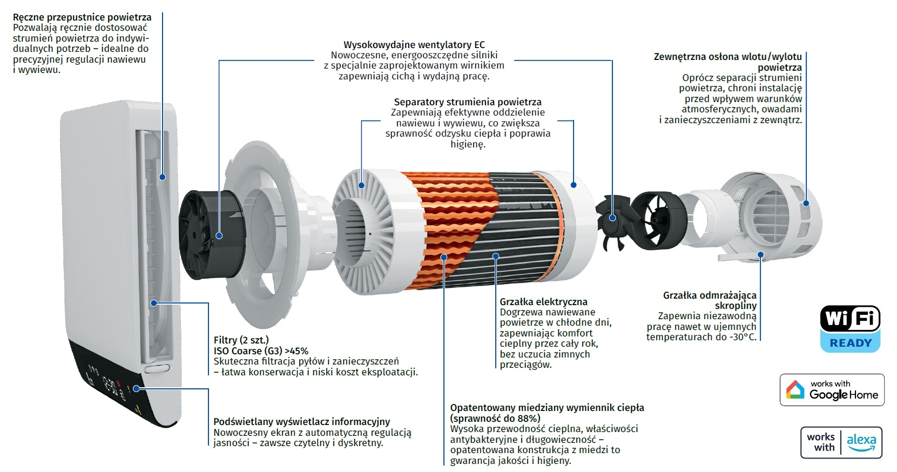

```{r setup, include=FALSE}
Sys.setlocale("LC_ALL", "Polish_Poland.1250")
knitr::opts_chunk$set(echo = FALSE, message = FALSE, warning = FALSE)
library(knitr)
library(kableExtra)
library(magrittr)
scroll_css <- "
.table-wrap { overflow-x:auto; }
table { width: 100%; }
"

theme_tbl_df <- function(df, caption = NULL, font_pct = 85) {
  stopifnot(is.data.frame(df))
  k <- knitr::kable(
    df,
    format  = "html",
    caption = caption,
    escape  = FALSE                 # << pozwala na HTML w komórkach (tooltips, linki itp.)
  ) |>
    kableExtra::kable_styling(
      bootstrap_options = c("striped","hover","condensed","responsive"),
      full_width = TRUE,
      position   = "center"
    ) |>
    kableExtra::row_spec(
      0,
      background = "#d9edf7",
      bold = TRUE,
      extra_css = paste0("font-size:", font_pct, "%; text-align:center; vertical-align: middle;")
    ) |>
    kableExtra::column_spec(
      1,
      extra_css = paste0("white-space: nowrap; font-size:", font_pct, "%; text-align: left; vertical-align: top;")
    )

  if (ncol(df) > 1) {
    k <- k |>
      kableExtra::column_spec(
        2:ncol(df),
        extra_css = paste0("white-space: nowrap; font-size:", font_pct, "%; text-align: center; vertical-align: top;")
      )
  }
  k
}
```

<link href="https://cdnjs.cloudflare.com/ajax/libs/lightbox2/2.11.4/css/lightbox.min.css" rel="stylesheet">
<script src="https://cdnjs.cloudflare.com/ajax/libs/lightbox2/2.11.4/js/lightbox.min.js"></script>

<style>
`r scroll_css`

#sekcja-ukryta {
  display: none;
}

.gallery {
  display: flex;
  flex-wrap: wrap;         /* zawijanie wierszy przy mniejszych ekranach */
  justify-content: center; /* wyśrodkowanie całości */
  gap: 5px;               /* odstęp między zdjęciami */
  margin: 5px 0;
}
.gallery img {
  width: 220px;            /* szerokość każdej miniaturki */
  height: auto;
  border-radius: 10px;
  box-shadow: 0 4px 12px rgba(0,0,0,0.06);
}
</style>


# O nas
VENTS GROUP Sp z o.o. to firma o ugruntowanej pozycji na rynku
branży wentylacyjnej. W momencie swojego powstania, jako Domus
Ducting Polska Sp. z o.o. była jednym z kilku pionierów wprowadzających na rynek polski systemy wentylacji mechanicznej. Podążając
za nowymi trendami i budując świadomość odbiorców w branży
firma przez lata rozwijała swoją ofertę wzbogacając ją o asortyment
z zakresu rekuperacji. Dziś oferuje kompleksową gamę produktów od
kratek wentylacyjnych po modułowe centrale klimatyzacyjno-wentylacyjne. Ten szeroki zakres asortymentowy zapewnia firmie potężne
zaplecze międzynarodowej grupy BLAUBERG z jej siedmioma zakładami produkcyjnymi w Europie, której Vents Group jest częścią. 

Jako firma oferujemy kompleksowe rozwiązania wentylacji i rekuperacji.  
Atuty: szerokie portfolio, dostępność urządzeń, wsparcie techniczne, program **Czyste Powietrze** (ZUM).

---

<p>
  
</p>

# Rekuperacja domowa

## Kluczowe korzyści
- Oszczędność energii (nawet do ~25% kosztów ogrzewania).  
- Filtracja powietrza (smog, kurz, alergeny), brak pleśni i przeciągów.  
- Lepsza klasa energetyczna budynku, wyższa wartość nieruchomości.

---

## Seria RENEO 


<br>Atuty serii Reneo: 

- **Szeroka oferta** - umożliwia zastosowanie zarówno w budynkach mieszkalnych, jak i lokalach użyteczności publicznej.
- **Obudowa EPP** - pozwalająca na cichą pracę bez zakłócania domowego spokoju.
- **Szybki i wygodny montaż** - kompaktowa budowa, inteligentne złącza, a także szablon na kartonie ułatwiający montaż.
- **Intuicyjna konfiguracja** - rekuperator Plug&Play z możliwością sterowania przewodowego oraz zdalną kontrolą dzięki aplikacji VentsApp Cloud.
- **Wysoka sprawność odzysku ciepła** - minimalizacja strat ciepła zimą i zmniejszenie obciążenia klimatyzacji latem.
- **Silnik EC oraz wysokosprawny przeciwprądowy wymiennik ciepła** - zmniejszenia zapotrzebowania na energię cieplną budynku.
- **Automatyczne sterowanie** - komfortowa temperatura, wilgotność oraz poziom CO₂ wewnątrz budynku przez cały rok.
- **W standardzie moduł stałego przepływu powietrza** - umożliwia elestyczność zastosowania.
- **Dostęp do wsparcia technicznego i materiałów szkoleniowych.**
- **5 lat gwarancji** po rejestracji w aplikacji VentsApp Cloud; standardowo 3 lata
- **Sterowanie z aplikacji** - pełna kontrola z dowolnego miejsca.

```{r reneo_tbl}
reneo <- data.frame(
  Model = c("Reneo-Fit D 100 (-E) VG","Reneo-Fit D 150/200 (-E) VG","Reneo D 180/240 (-E) VG","Reneo S/SE 210/270 (-E) VG","Reneo S/SE 350 (-E) VG"),
  `Wydajność [m³/h]` = c("~130","~229-279","~181-310","~277-331","~410"),
  `Sprawność odzysku ciepła` = c("do 94%","do 89%","do 91%","do 89%","do 92%"),
  `Poziom hałasu [dB(A)/3m]` = c("32","27-33","29-33","31-34","27"),
  `Pobór prądu [W]*` = c("45","72-111","53-171","125-182","210"),
  Link = c('[Zobacz szczegóły](https://vents-group.pl/oferta/wentylacja-profesjonalna-centrale/reneo-fit-d-100)',
           '[Zobacz szczegóły](https://vents-group.pl/oferta/wentylacja-profesjonalna-centrale/reneo-fit-d-150-200-e-vg)',
           '[Zobacz szczegóły](https://vents-group.pl/oferta/wentylacja-profesjonalna-centrale/reneo-d-180-240-e-vg)',
           '[Zobacz szczegóły](https://vents-group.pl/oferta/wentylacja-profesjonalna-centrale/reneo-s-se-210-270-e-vg)',
           '[Zobacz szczegóły](https://vents-group.pl/oferta/wentylacja-profesjonalna-centrale/reneo-s-se-350-350-e-vg)'),
    check.names = FALSE
)
theme_tbl_df(reneo, caption = "RENEO — unikatowe parametry techniczne")
```

## Centrale wentylacyjne VUT/VUTR

<h4>Zalety naszych central wentylacyjnych nawiewno-wywiewnych z odzyskiem ciepła:</h4>

- **Dostępność** – *dla wydajności do 1000 m³/h* – Posiadamy 24 modele dostępne od ręki  
- **Wentylator z silnikiem EC** – sprawność do 90%, zużycie energii elektrycznej zmniejszone o 1,5–3 razy  
- **Izolacja obudowy 40 mm wełny mineralnej** – zapewnia cichą pracę urządzenia  
- **Klasa efektywności energetycznej A lub A+**  
- **Filtry typu minipleat – klasa F7** – w większości central podwójna filtracja G4 i F7  
- **W standardzie** – bezprzewodowe sterowanie pracą centrali za pomocą aplikacji mobilnej


<br>


<br>
```{r cw_tbl}
cw_kompaktowe <- data.frame(
  Seria = c("VUT 100 P MINI","VUT/VUE H2/V2 mini EC"),
  `Wydajność [m³/h]` = c("~55-100","~300"),
  `Sprawność odzysku ciepła` = c("do 76%","do 79%"),
  `Poziom hałasu [dB(A)/3m]` = c("24-41","33"),
  `Pobór prądu [W]*` = c("30-56","165"),
  `Typ wymiennika` = c("krzyżowy","krzyżowy"),
  Link = c('[Zobacz szczegóły](https://vents-group.pl/oferta/wentylacja-profesjonalna-centrale/vut-100-p-mini)',
           '[Zobacz szczegóły](https://vents-group.pl/oferta/wentylacja-profesjonalna-centrale/vut-vue-v2-h2-mini-ec)'),
    check.names = FALSE
)
theme_tbl_df(cw_kompaktowe, caption = "Centrale wentylacyjne mini - parametry techniczne")

cw_podwieszane <- data.frame(
  Seria = c("VUT PB EC A21","VUT PBE/PBW EC A21", "VUTR PE EC A21"),
  `Wydajność [m³/h]` = c("~190-410","~340-620", "~310"),
  `Sprawność odzysku ciepła` = c("do 94%","do 90%", "do 87%"),
  `Poziom hałasu [dB(A)/3m]` = c("26-34","27-30","21"),
  `Pobór prądu [W]*` = c("50-170","180-297","135"),
  `Typ wymiennika` = c("przeciwprądowy","przeciwprądowy","obrotowy"),
  Link = c('[Zobacz szczegóły](https://vents-group.pl/oferta/wentylacja-profesjonalna-centrale/vut-pb-ec-a21)',
           '[Zobacz szczegóły](https://vents-group.pl/oferta/wentylacja-profesjonalna-centrale/vut-pbe-pbw-ec)',
           '[Zobacz szczegóły](https://vents-group.pl/oferta/wentylacja-profesjonalna-centrale/vutr-p-ec-vutr-pe-ec-a21)'),
    check.names = FALSE
)
theme_tbl_df(cw_podwieszane, caption = "Centrale wentylacyjne podwieszane - parametry techniczne")

cw_stojace <- data.frame(
  Seria = c("VUTR VE EC A21","VUT/VUE HB/HBE EC A21"),
  `Wydajność [m³/h]` = c("~300-670","~380"),
  `Sprawność odzysku ciepła` = c("do 90%","do 98%"),
  `Poziom hałasu [dB(A)/3m]` = c("26-35","24"),
  `Pobór prądu [W]*` = c("195-405","182"),
  `Typ wymiennika` = c("obrotowy","przeciwprądowy"),
  Link = c('[Zobacz szczegóły](https://vents-group.pl/oferta/wentylacja-profesjonalna-centrale/vutr-v-ve-ec)',
           '[Zobacz szczegóły](https://vents-group.pl/oferta/wentylacja-profesjonalna-centrale/vut-hb-hbe-ec)'
           ),
    check.names = FALSE
)
theme_tbl_df(cw_stojace, caption = "Centrale wentylacyjne stojące - parametry techniczne")

cw_uni <- data.frame(
  Seria = c("VUT/VUE VB EC A21"),
  `Wydajność [m³/h]` = c("~200-390"),
  `Sprawność odzysku ciepła` = c("do 95%"),
  `Poziom hałasu [dB(A)/3m]` = c("24-35"),
  `Pobór prądu [W]*` = c("57-180"),
  `Typ wymiennika` = c("przeciwprądowy"),
  Link = c('[Zobacz szczegóły](https://vents-group.pl/oferta/wentylacja-profesjonalna-centrale/vut-vb-ec-a21)'
           ),
    check.names = FALSE
)
theme_tbl_df(cw_uni, caption = "Centrale wentylacyjne z uniwersalnym montażem - parametry techniczne")
```

---

## Kanały elastyczne FlexiVent

<br>
<br>
<h4>**Charakterystyka naszych kanałów elastycznych:**</h4>

- Brak hałasu
- Prosty i szybki montaż
- Dobre parametry techniczne
- Gładka powierzchnia, niskie opory powietrza
- Powłoka antystatyczna
- Zapobiega odkładaniu drobin
- Powłoka antybakteryjna
- Wytrzymałość


```{=html}
<div style="display: flex; gap: 20px; margin: 20px 0;">

  <div style="flex: 1; border: 1px solid #ddd; border-radius: 10px; padding: 16px; background: #fff; box-shadow: 0 2px 6px rgba(0,0,0,0.1);">
    <h4 style="margin-top:0; color:#0b5cad;">System kanałów okrągłych fi 75 mm</h4>
    <p style="text-align: center;">
      
          </p>
    <p><b>Wymiary:</b> DN 75 mm, rolka 50 m<br><b>Przepływ:</b> do 30 m³/h<br><b>Opór:</b> ok. 2,5 Pa na 1 mb</p>
    <p><b>W ofercie:</b> <br>- Kanały elastyczne <br>- Rozdzielacze<br>- Skrzynki rozprężne<br>- Akcesoria<br>- Elementy składowe</p>
        <p style="text-align: center;">
          </p>
  </div>

  <div style="flex: 1; border: 1px solid #ddd; border-radius: 10px; padding: 16px; background: #fff; box-shadow: 0 2px 6px rgba(0,0,0,0.1);">
    <h4 style="margin-top:0; color:#0b5cad;">System kanałów owalnych 52×117 mm</h4>
    <p style="text-align: center;">
      
      
    </p>
    <p><b>Wymiary:</b> owal 52×117 mm, rolka 50 m<br><b>Przepływ:</b> do 40 m³/h<br><b>Opór:</b> ok. 4 Pa na 1 mb<br><b>Mała wysokość systemu</b></p>
    <p><b>W ofercie:</b> <br>- Kanały elastyczne <br>- Rozdzielacze<br>- Skrzynki rozprężne<br>- Akcesoria </p>
    <p style="text-align: center;">
          </p>
  </div>

</div>
```


Sprawdź szczeóły systemu wentylacyjnego FlexiVent na naszej stronie: [Zobacz szczegóły](https://vents-group.pl/oferta/wentylacja-profesjonalna/system-wentylacyjny-flexivent)

#### Wybrali nasze centrale
<p>*Kliknij miniaturę, aby powiększyć zdjęcie i poznać szczegóły.*</p>

<div class="gallery">

<a href="images/VUT/1.jpg" data-lightbox="domowa" data-title="VUT 1000 PE EC, TT PRO 160 — Wellclinic, Warszawa ul. Kolejowa 49a/lok U9 01-210">
  
</a>
<a href="images/VUT/2.jpg" data-lightbox="domowa" data-title="VUT 1500 PE EC — Burger King, Czechowice-Dziedzice ul. Węglowa 17, 43-500">
  
</a>
<a href="images/VUT/3.jpg" data-lightbox="domowa" data-title="VUT 1500 PE EC — KFC, Piekary Śląskie ul. Kariola Miarki 13 e, 41-940; Kielce Al.. Jerzego Szajnowicza-Iwanowicza 17, 25-001;  Oława Nowy Górnik 55-200; Żary ul. Katowicka 34, 68-200">
  
</a>
<a href="images/VUT/4.jpg" data-lightbox="domowa" data-title="VUT 3000 PE EC - Mrówka, Radomyśl Wielki ul. Kościuszki 13 A, 39-310">
  
</a>
<a href="images/VUT/5.jpg" data-lightbox="domowa" data-title="VUT 1500 PE EC - Pizza Hut, Wałbrzych 1 maja 64 58-300">
  
</a>

</div>

---

# Rekuperacja decentralna


## Dlaczego decentralna?
- Brak konieczności wykonywania projektu – oszczędność czasu
- Szybki i prosty montaż - brak konieczności rozprowadzania instalacji
- Gwarancja ciągłej pracy systemu
- Wielkość, wyposażenie oraz automatykę centrali dobiera się do indywidualnych potrzeb pomieszczenia
- Zwiększenie bezpieczeństwa przeciwpożarowego budynku
- Eliminacja smogu i alergenów pochodzących z pyłków drzew, traw, zbóż, dzięki zastosowaniu filtrów wysokiej klasy
- Jest to system higieniczny: brak potrzeby czyszczenia kanałów wentylacyjnych 
- Możliwość demontażu i ponowny montaż w innym pomieszczeniu
- Idealna do modernizacji i pojedynczych pomieszczeń. *(Rynek zbytu: Budynki modernizowane, budynki mieszkalne, budynki biurowe, budynki instytucjonalne, użyteczności publicznej – czytelnie, biblioteki, urzędy, przedszkola i szkoły)*

## **NOWOŚĆ**: Seria Freshpoint


<h4>**Zalety serii Freshpoint:**</h4>

- **Szerokie zastosowanie** – mieszkania, sypialnie, gabinety, małe sale dydaktyczne
- Dostępne urządzenia zarówno z **wymiennikiem miedzianym**, jak i wkrótce z **wymiennikiem ceramicznym**.
- **Sterowanie Wi-Fi** – aplikacja mobilna, harmonogramy, czujniki CO₂/tVOC (Pro)
- **Prosta obsługa** – wyświetlacz, pilot, sterowanie głosowe
- **Wbudowany separator strumienia powietrza** - zapobiega mieszaniu się powietrza nawiewanego i wywiewanego
- **Filtry G3, grzałka skroplin i folia grzewczą** - pozytywnie wpływa na komfort termiczny.

```{r freshpoint_tbl}
freshpoint <- data.frame(
  Seria                    = c("Freshpoint 160-E (PRO)", "Freshpoint 200-E (PRO)"),
  'Wydajność [m³/h]<span title="MAX Przy trybie BOOST">*</span>' = c('~15–70','~15–90'),
  "Sprawność odzysku ciepła" = c("do 88%", "do 85%"),
  "Poziom hałasu [dB(A)/3m]" = c("12–42", "15-45"),
  'Pobór prądu [W]<span title="Pobór mocy urządzenia bez grzałki">*</span>' = c('5–22', "5-22"),
  check.names = FALSE
)

theme_tbl_df(freshpoint, caption = "Jednostki z serii Freshpoint – parametry")
```

Skontaktuj się z nami, aby dowiedzieć się więcej o serii Freshpoint.

## Seria Vento


<h4>**Zalety serii Vento:**</h4>
- **Błyskawiczny montaż** – instalacja w pojedynczym otworze ściennym, bez sieci kanałów
- **Wysoka efektywność** – odzysk ciepła do 93%, klasa energetyczna A+
- **Inteligentne sterowanie** – aplikacja mobilna i praca wielu jednostek w sieci bezprzewodowej
- **Komfort użytkowania** – praca ultra cicha, z poziomem hałasu od 11 dBA
- **Bezpieczeństwo** – automatyczne przepustnice zapobiegające przeciągom i cofaniu się powietrza

```{r decentralna_tbl}
r_decentralna <- data.frame(
  Seria = c("Vento Expert A50-1 S10 Pro",
            "Vento Expert A50-1 S10 W v.2", 
            "Vento Expert A100-1 S10 W v.2",
            "Vento Expert Duo A30-1 S10 Pro",
            "Vento Expert Duo A30-1 S10 W v.2",
            "Vento Eco A50-4 S11 Pro",
            "Vento Eco2 A50-4 S11 Pro",
            "Vento inHome Wi-Fi"),
  `Wydajność [m³/h]` = c("~15-50",
                         "~15-50",
                         "~18-108",
                         "~10-60",
                         "~10-60",
                         "~8-50",
                         "~8-50",
                         "~15-50"),
  `Sprawność odzysku ciepła` = c("do 93%",
                                 "do 93%",
                                 "do 87%",
                                 "do 85%",
                                 "do 85%",
                                 "do 92%",
                                 "do 92%",
                                 "do 88%"),
  `Poziom hałasu [dB(A)/3m]` = c("11-21",
                                 "11-21",
                                 "13-42",
                                 "24-34",
                                 "24-34",
                                 "12-29",
                                 "12-29",
                                 "11-27"),
  `Pobór prądu [W]` = c("3,61-5,20",
                         "4,45-7,06",
                         "3,20-18,0",
                         "2,00-6,40",
                         "2,17-6,62",
                         "1,00-4,30",
                         "1,00-4,30",
                         "1,70-4,30"),
  Link = c('[Zobacz szczegóły](https://vents-group.pl/oferta/wentylacja-decentralna/rekuperatory-scienne-jednorurowe/vento-expert-a50-1-s10-pro)',
           '[Zobacz szczegóły](https://vents-group.pl/oferta/wentylacja-decentralna/rekuperatory-scienne-jednorurowe/vento-expert-a50-1-s10-w-v-2)',
           '[Zobacz szczegóły](https://vents-group.pl/oferta/wentylacja-decentralna/rekuperatory-scienne-jednorurowe/vento-expert-a100-1-s10-w-v-2)',           
           '[Zobacz szczegóły](https://vents-group.pl/oferta/wentylacja-decentralna/rekuperatory-scienne-jednorurowe/vento-expert-duo-a30-1-s10-pro)',
           '[Zobacz szczegóły](https://vents-group.pl/oferta/wentylacja-decentralna/rekuperatory-scienne-jednorurowe/vento-expert-a100-1-s10-w-v-2)',           
           '[Zobacz szczegóły](https://vents-group.pl/oferta/wentylacja-decentralna/rekuperatory-scienne-jednorurowe/vento-eco-a50-4-s11-pro)',           
           '[Zobacz szczegóły](https://vents-group.pl/oferta/wentylacja-decentralna/rekuperatory-scienne-jednorurowe/vento-eco2-a50-4-s11-pro)',
           '[Zobacz szczegóły](https://vents-group.pl/oferta/wentylacja-decentralna/rekuperatory-scienne-jednorurowe/vento-inhome-wi-fi)'
           ),
    check.names = FALSE
)
theme_tbl_df(r_decentralna, caption = "Rekuperatory ścienne jednorurowe - parametry techniczne")

```

<p style="margin-top:30px;"></p>
**NOWOŚĆ** - możliwość stylizacji Vento InHome dzięki materiałowej nakładce. <br>
<br>


## Seria Freshbox

<h4>**Zalety serii Freshbox -  Centrale wentylacyjne do pojedynczych pomieszczeń:**</h4>
- **Pełna wentylacja** – jednoczesny nawiew i wywiew z odzyskiem ciepła do 96%
- **Oszczędność energii** – wysokosprawny wymiennik przeciwprądowy ograniczający straty ogrzewania
- **Komfort zimą** – opcjonalna nagrzewnica elektryczna dogrzewająca nawiewane powietrze
- **Filtracja powietrza** – wielostopniowe filtry zatrzymujące kurz, alergeny i smog *(- możliwość stosowania filtrów klasy H13 o skuteczności do 99% zatrzymywania smogu)*
- **Prosta obsługa** – panel sterowania, pilot lub sterowanie przez Wi-Fi w modelach Freshbox Wi-Fi

```{r freshbox_tbl}
freshbox <- data.frame(
  Seria = c("Freshbox 100",
            "Freshbox 100 Wi-Fi", 
            "Freshbox 200 ERV Wi-Fi"),
  `Wydajność [m³/h]` = c("~30-100",
                         "~30-100",
                         "~83-200"),
  `Sprawność odzysku ciepła` = c("do 98%","do 96%","do 85%"),
  `Poziom hałasu [dB(A)/3m]` = c("13-39","13-39","12-45"),
  `Pobór prądu [W]*` = c("12-45","20-53","10-134"),
  Link = c('[Zobacz szczegóły](https://vents-group.pl/oferta/wentylacja-decentralna/centrale-wentylacyjne-do-pojedynczych-pomieszczen/freshbox-100)',
           '[Zobacz szczegóły](https://vents-group.pl/oferta/wentylacja-decentralna/centrale-wentylacyjne-do-pojedynczych-pomieszczen/freshbox-100-wi-fi)',
           '[Zobacz szczegóły](https://vents-group.pl/oferta/wentylacja-decentralna/centrale-wentylacyjne-do-pojedynczych-pomieszczen/freshbox-200-erv-wi-fi)'),
    check.names = FALSE
)
theme_tbl_df(freshbox, caption = " Centrale wentylacyjne do pojedynczych pomieszczeń - parametry techniczne")
```

## Seria CIVIC 


<h4>**Zalety serii Civic:**</h4>
- **Przeznaczone dla większych sal** – idealne do szkół, biur, sal konferencyjnych czy bibliotek
- **Duża wydajność** – modele z przepływem powietrza nawet do 1200 m³/h
- **Wysoka sprawność** – odzysk ciepła na poziomie 90–96% dzięki wymienni-kom przeciwprądowym
- **Inteligentne zarządzanie** – system S21 z możliwością integracji z BMS i Smart Home
- **Komfort i bezpieczeństwo** – cicha praca, automatyczne hermetyczne przepustnice, izolacja akustyczna i termiczna

```{r civic_tbl}
civic <- data.frame(
  Model = c("CIVIC EC DB(E/E2) 300 S21 V.2",
            "CIVIC EC DB(E/E2) 500 S21 V.2", 
            "CIVIC EC DB(E/E2) 1000 S21 V.2",
            "Civic EC LB(E/E2) 300 S21 V.2",
            "Civic EC LB(E/E2) 300-E S21 V.2",
            "Civic EC LB(E/E2) 500 S21 V.2",
            "Civic EC LB(E/E2) 1200 S21 V.2"),
  `Wydajność [m³/h]` = c("~300",
                         "~510",
                         "~1000",
                         "~320",
                         "~320",
                         "~580",
                         "~1240"),
  `Sprawność odzysku ciepła` = c("do 92%","do 96%","do 93%","do 94%","do 89%","do 94%","do 96%"),
  `Poziom hałasu [dB(A)/3m]` = c("34","34","24", "37","37","38","30"),
  `Pobór prądu [W]*` = c("204","238","267","96","96","370","345"),
  Link = c('[Zobacz szczegóły](https://vents-group.pl/oferta/wentylacja-decentralna/centrale-wentylacyjne-do-pojedynczych-pomieszczen-w-budynkach-instytucjonalnych/civic-ec-d)',
           '[Zobacz szczegóły](https://vents-group.pl/oferta/wentylacja-decentralna/centrale-wentylacyjne-do-pojedynczych-pomieszczen-w-budynkach-instytucjonalnych/civic-ec-d)',
           '[Zobacz szczegóły](https://vents-group.pl/oferta/wentylacja-decentralna/centrale-wentylacyjne-do-pojedynczych-pomieszczen-w-budynkach-instytucjonalnych/civic-ec-d)',
           '[Zobacz szczegóły](https://vents-group.pl/oferta/wentylacja-decentralna/centrale-wentylacyjne-do-pojedynczych-pomieszczen-w-budynkach-instytucjonalnych/civic-ec-lb)
           ',
           '[Zobacz szczegóły](https://vents-group.pl/oferta/wentylacja-decentralna/centrale-wentylacyjne-do-pojedynczych-pomieszczen-w-budynkach-instytucjonalnych/civic-ec-lb)
           ',
           '[Zobacz szczegóły](https://vents-group.pl/oferta/wentylacja-decentralna/centrale-wentylacyjne-do-pojedynczych-pomieszczen-w-budynkach-instytucjonalnych/civic-ec-lb)
           ',
           '[Zobacz szczegóły](https://vents-group.pl/oferta/wentylacja-decentralna/centrale-wentylacyjne-do-pojedynczych-pomieszczen-w-budynkach-instytucjonalnych/civic-ec-lb)
           '),
    check.names = FALSE
)
theme_tbl_df(civic, caption = "Centrale wentylacyjne do pojedynczych pomieszczeń - parametry techniczne")

```


#### Wybrali nasze rekuperatory decentralne
<p>*Kliknij miniaturę, aby powiększyć zdjęcie.*</p>

<div class="gallery">

<a href="images/Decentralna/1.jpg" data-lightbox="decentralna" data-title="">
  
</a>
<a href="images/Decentralna/2.jpg" data-lightbox="decentralna" data-title="">
  
</a>
<a href="images/Decentralna/3.jpg" data-lightbox="decentralna" data-title="">
  
</a>
<a href="images/Decentralna/4.jpg" data-lightbox="decentralna" data-title="">
  
</a>
<a href="images/Decentralna/5.jpg" data-lightbox="decentralna" data-title="">
  
</a>

</div>

---

# Centrale AirVents


## Centrale kompaktowe

- **Gotowe do pracy** – fabryczna konfiguracja typu *plug & play*, szybki montaż
- **Pełne wyposażenie** – wymiennik ciepła, wentylatory i automatyka w jednej obudowie + wybrane akcesoria
- **Oszczędność miejsca** – kompaktowa konstrukcja idealna do budynków z ograniczoną przestrzenią techniczną
- **Energooszczędność** – wentylatory EC i wysoka sprawność wymienników
- **Łatwa obsługa** – automatyka z panelem sterującym


---


```{r airvents_tbl}
airvents <- data.frame(
  Seria = c("CFP",
            "RP", 
            "CFH","RH","CFV","RV"),
  `Wydajność [m³/h]` = c("~1500-6000",
                         "~1500-2500",
                         "~1500-6000","~1500-6000","~1500-6000","~1500-6000"),
  `Montaż` = c("podwieszany","podwieszany","podłogowy","podłogowy","podłogowy","podłogowy"),
  `Wymiennik ciepła` = c("przeciwprądowy","obrotowy","przeciwprądowy","obrotowy","przeciwprądowy","obrotowy"),
  `Wielkości` = c("CFP 1500/2500/3500/5000/6000","RP 1500/2500","CFH 1500/2500/3500/5000/6000","RH 1500/2500/3500/5000/6000","CFV 1500/2500/3500/5000/6000","RV 800/1200/1500/2500/3500/5000/6000"),
  `Automatyka` = c("A30/A32","A30/A32","A30/A32","A30/A32","A30/A32","A30/A32"),
  Link = c('[Zobacz szczegóły](https://vents-group.pl/oferta/centrale-airvents/kompaktowe-centrale-airvents/cfp)',
           '[Zobacz szczegóły](https://vents-group.pl/oferta/centrale-airvents/kompaktowe-centrale-airvents/rp)',
           '[Zobacz szczegóły](https://vents-group.pl/oferta/centrale-airvents/kompaktowe-centrale-airvents/cfh)',
           '[Zobacz szczegóły](https://vents-group.pl/oferta/centrale-airvents/kompaktowe-centrale-airvents/rh)',
           '[Zobacz szczegóły](https://vents-group.pl/oferta/centrale-airvents/kompaktowe-centrale-airvents/cfv)',
           '[Zobacz szczegóły](https://vents-group.pl/oferta/centrale-airvents/kompaktowe-centrale-airvents/rv)'),
    check.names = FALSE
)
theme_tbl_df(airvents, caption = "Kompaktowe centralne AirVents - parametry techniczne")

```

## Centrale modułowe

```{=html}
<div style="display: flex; gap: 20px; margin: 20px 0;">

  <div style="flex: 1; border: 1px solid #ddd; border-radius: 10px; padding: 16px; background: #fff; box-shadow: 0 2px 6px rgba(0,0,0,0.1);">
    <h4 style="margin-top:0; color:#0b5cad;">Konstrukcja bezszkieletowa</h4><br><br>
    <p style="text-align: center;">
      
      </p>
  </div>

  <div style="flex: 1; border: 1px solid #ddd; border-radius: 10px; padding: 16px; background: #fff; box-shadow: 0 2px 6px rgba(0,0,0,0.1);">
    <h4 style="margin-top:0; color:#0b5cad;">Konstrukcja oparta na szkielecie z profili aluminiowych
</h4><br>
    <p style="text-align: center;">
      
      </p>
  </div>

</div>
```

- **Elastyczność konfiguracji** – możliwość zestawiania modułów (nagrzewnice, chłodnice, filtry, tłumiki) zgodnie z potrzebami inwestycji  
- **Skalowalność – od małych** do bardzo dużych systemów wentylacyjnych  
- **Zaawansowana automatyka** – Kompatybilność z systemami inteligentnego sterowania budynkami (SCADA,BMS)
- **Serwis i konserwacja** – łatwy dostęp do poszczególnych sekcji, uproszczona eksploatacja  
- **Zastosowanie profesjonalne** – idealne do obiektów przemysłowych, handlowych i dużych budynków użyteczności publicznej  
- **Wykonanie plug&play**

#### Wybrali nasze centrale AirVents
<p>*Kliknij miniaturę, aby zobaczyć szczegóły.*</p>

<div class="gallery">

<a href="images/AirVents/2_1.jpg" data-lightbox="airvents" data-title="AirVents — Gminne Przedszkole Publiczne Szamocin Ul. Plac Wolności 31, 64-820">
  
</a>
<a href="images/AirVents/3_1.jpg" data-lightbox="airvents" data-title="AirVents — Mediaexpert w Parku Handlowym Złotów Ul. Za Dworcem 1D">
  
</a>
<a href="images/AirVents/4_1.jpg" data-lightbox="airvents" data-title="AirVents — Hala produkcyjna Ilpea Chełstówek 2a">
  
</a>
<a href="images/AirVents/1_1.jpg" data-lightbox="airvents" data-title="AirVents — TAURON Dystrybucja SA Tarnów">
  
</a>
<a href="images/AirVents/5_1.jpg" data-lightbox="airvents" data-title="AirVents — Stacja regeneracji węgla aktywnego, Imielin ul. Rzemieślnicza 5A">
  
</a>

</div>

---

Dowiedz się więcej na [stronie Vents Group](https://vents-group.pl/).